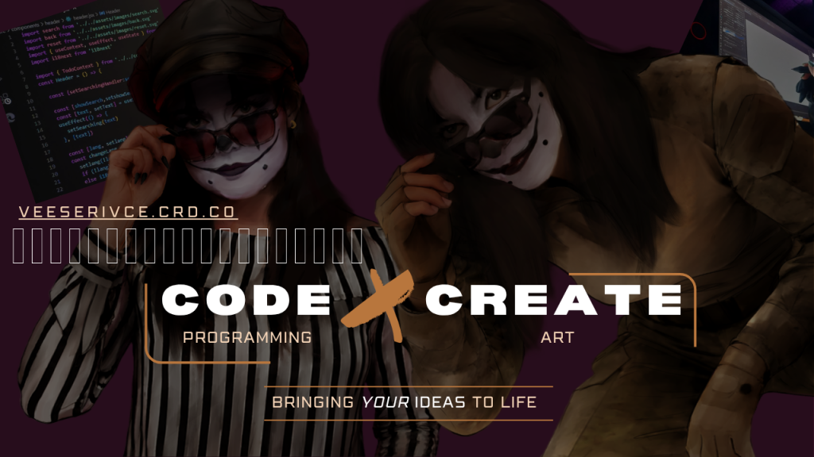

<!--
  VEEBUILTTHAT — GitHub Profile README
  GitHub supports Markdown and a subset of HTML.
  It does not allow custom CSS or JavaScript in profile README files.
-->

<div align="center">



# VEEBUILTTHAT


<br>

**PROGRAMMING · ART · DESIGN**

<br>


<br><br>

<a href="https://veeservices.crd.co">
  
</a>
<a href="mailto:veebuiltthat@gmail.com">
  
</a>
<a href="https://instagram.com/veebuiltthat">
  
</a>

<br><br>


</div>

---

```javascript
const VeeBuiltThat = {
  class: "creative developer",
  alignment: "chaotic good",

  disciplines: [
    "web development",
    "automation",
    "digital art",
    "visual design"
  ],

  aesthetic: [
    "dark fantasy",
    "burgundy",
    "gold",
    "dragons"
  ],

  status: "surviving, creating, compiling",

  objective() {
    return "turn strange ideas into working software";
  }
};
```

<div align="center">

### `PROGRAMMING  ✦  ART  ✦  DESIGN`

</div>

---

## `01 // CURRENT TRANSMISSION`

```text
> building      interactive websites
> learning      JavaScript without losing my sanity
> designing     VeeBuiltThat · VeeDev · VexWing
> accepting     commissions and creative collaborations
> powered by    caffeine, spite and questionable architecture
```

I build expressive digital experiences where **code and art meet**.

My work is inspired by dark fantasy, theatrical design, hand-drawn textures and the slightly strange corners of the web.

---

## `02 // SELECTED BUILDS`

<table>
<tr>
<td width="33%" valign="top">

### RF-CLOWN v2.0.0

A 2.4 GHz RF channel-hopping research tool built with Arduino and nRF24L01+ hardware.

<br>

**Built with**

`C++` `Arduino` `nRF24L01+` `RF`

<br>

<a href="https://github.com/VeeBuiltThat/IoT_exam">
  
</a>

</td>
<td width="33%" valign="top">

### MousseMail

A lightweight Discord mod-mail and ticketing bot that creates private support channels from direct messages.

<br>

**Built with**

`Python` `Discord.py` `Automation`

<br>

<a href="https://github.com/VeeBuiltThat/CCAC-MousseMail-PYTHON">
  
</a>

</td>
<td width="33%" valign="top">

### Dixie

A modular Discord moderation bot with warnings, logging, blacklists, slowmode and protection systems.

<br>

**Built with**

`Python` `SQLite` `Discord.py`

<br>

<a href="https://github.com/VeeBuiltThat/CCAC-DIXIE-PYTHON-">
  
</a>

</td>
</tr>
</table>

---

## `03 // LOADOUT`

<div align="center">


<br><br>


</div>

---

## `04 // SYSTEM TELEMETRY`

<div align="center">


<br><br>


</div>

---

## `05 // CONTRIBUTION FAMILIAR`

<div align="center">


</div>

---

<table>
<tr>
<td width="50%" valign="top">

## `06 // AVAILABLE FOR`

- Front-end collaborations
- Portfolio and landing pages
- Discord automation
- Creative coding experiments
- Illustration and visual design
- Strange ideas with good typography

</td>
<td width="50%" valign="top">

## `07 // SIGNALS`

- **Portfolio:** [Vee Services](https://veeservices.crd.co)
- **Instagram:** [@VeeBuiltThat](https://instagram.com/veebuiltthat)
- **GitHub:** [@VeeBuiltThat](https://github.com/VeeBuiltThat)
- **Email:** [veebuiltthat@gmail.com](mailto:veebuiltthat@gmail.com)

</td>
</tr>
</table>

---

<div align="center">

<br>

### `BRINGING YOUR IDEAS TO LIFE`

<sub>Built with code, caffeine and a deeply suspicious number of dragons.</sub>

</div>
