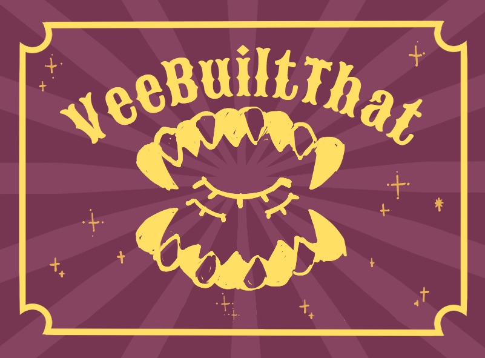

<<<<<<< HEAD
<!--
  VEEBUILTTHAT — GitHub Profile README
  Replace every placeholder written in ALL CAPS.
  GitHub strips custom CSS and JavaScript, so this layout uses supported
  HTML tables, images, badges and Markdown.
-->

<div align="center">


# VEEBUILTTHAT

### `CODE × CREATE`

**PROGRAMMING · ART · DESIGN**

<br>



<br><br>

<a href="https://github.com/veebuiltthat">
  
</a>
<a href="https://veeservices.crd.co">
  
</a>
<a href="mailto:veebuiltthat@gmail.com">
  
</a>

</div>

<br>

<table>
<tr>
<td width="58%" valign="top">

## ✦ ABOUT ME

```javascript
const vee = {
  role: ["developer", "artist", "creator"],
  focus: "bringing ideas to life",
  currentlyLearning: [
    "JavaScript",
    "responsive web design",
    "creative coding"
  ],
  likes: [
    "dark colour palettes",
    "character design",
    "strange little websites",
    "dragons"
  ]
};
```

I build expressive digital experiences where **code and art meet**.

My work is inspired by dark fantasy, theatrical design, hand-drawn textures and the slightly strange corners of the web.

</td>
<td width="42%" valign="top">

## ✦ CURRENTLY

- Building **Interactive websites**
- Learning **Surviving**
- Designing **VeeBuiltThat / VeeDev / VexWing**
- Open to **COMMISSIONS / COLLABORATIONS**

## ✦ LINKS

- Portfolio: **[Vee Services](https://veeservices.crd.co)**
- Instagram: **[@VeeBuiltThat](https://instagram.com/veebuiltthat)**
- Email: **[veebuiltthat@gmail.com](mailto:veebuiltthat@gmail.com)**

</td>
</tr>
</table>

---

<div align="center">

## ✦ TOOLS OF THE TRADE


<br><br>


</div>

---

<table>
<tr>
<td width="50%" valign="top">

## ✦ FEATURED PROJECT 01

### [RF-CLOWN v2.0.0](https://github.com/VeeBuiltThat/IoT_exam)

A 2.4 GHz RF channel-hopping research tool built on Arduino + nRF24L01+

**Built with:** `C++` `C` 

[VIEW REPOSITORY →](https://github.com/VeeBuiltThat/CCAC-MousseMail-PYTHON)

</td>
<td width="50%" valign="top">

## ✦ FEATURED PROJECT 02

### [MousseMail](https://github.com/VeeBuiltThat/CCAC-MousseMail-PYTHON)

A lightweight Discord mod-mail / ticketing bot that lets users open private ticket channels by messaging the bot. Designed for small to medium servers where staff need a clear, private way to handle user inquiries.

**Built with:** `Python` 

[VIEW REPOSITORY →](https://github.com/VeeBuiltThat/CCAC-MousseMail-PYTHON)

</td>
</tr>
</table>

<table>
<tr>
<td width="50%" valign="top">

## ✦ FEATURED PROJECT 03

### [Dixie](https://github.com/VeeBuiltThat/CCAC-DIXIE-PYTHON-)

Discord moderation bot used by CCAC. This repository contains the bot entrypoint, database helpers, and a set of moderation cogs (extensions) for warnings, blacklist handling, audit logs, anti-forward protection, slowmode, link-snatching, and more.

**Created with:** `Python`

[VIEW PROJECT →](https://github.com/VeeBuiltThat/CCAC-DIXIE-PYTHON-)

</td>
<td width="50%" valign="top">

## ✦ AVAILABLE FOR

- Front-end collaborations
- Portfolio and landing pages
- Creative coding experiments
- Illustration and visual design
- Strange ideas with good typography

</td>
</tr>
</table>

---

<div align="center">

## ✦ GITHUB ACTIVITY


<br><br>


<br>


<br>

### `BRINGING YOUR IDEAS TO LIFE`

<sub>Designed and built with code, caffeine and questionable amounts of purple.</sub>

</div>

=======
# Setup

1. Create a public GitHub repository whose name exactly matches your GitHub username.
2. Upload `README.md` and the complete `assets` folder.
3. Open `README.md` and replace:
   - `YOUR_USERNAME`
   - `YOUR_EMAIL`
   - `YOUR_HANDLE`
   - `YOUR_WEBSITE`
   - project names and links
4. Commit the changes.

## File structure

```text
YOUR_USERNAME/
├── README.md
└── assets/
    ├── dragon-logo.png
    ├── code-create-banner.webp
    └── veebuiltthat-banner.png
```

The layout uses GitHub-compatible HTML. GitHub does not permit custom CSS or JavaScript in profile README files.
>>>>>>> e1c5dd66facd7fd9cef53eb839ae511ebb347e41
